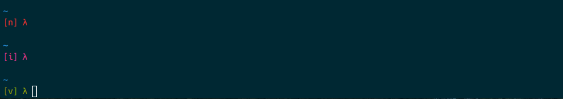
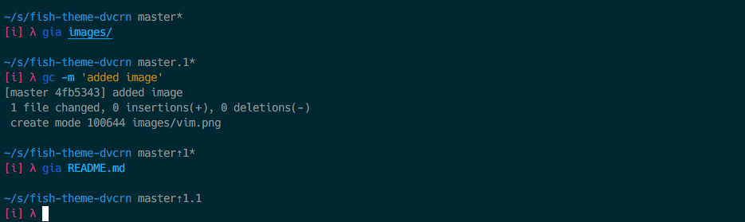

# theme-dvcrn

`dvcrn` is a minimalistic fish-shell theme inspired by the zsh [pure](https://github.com/sindresorhus/pure) theme with vim support baked in.

In short, this is how I like my shell. If you like to use it, please go for it :)

## Features

### vim support

Subtly indicating the vim state you are currently in without being too obnoxious. I went with different color tones but decided to include `[i]`, `[v]` and `[n]` as well to make it even more obvious.

### git support

Very inspired by pure. Following indicators are available:

Indicator | Meaning
----------|------------------------
`⇡`       | x commits ahead
`⇣`       | x commits behind
`.`       | x files stages
`+`       | x dirty files present
`*`       | untracked files present

## License

MIT © [David Mohl](https://github.com/dvcrn)
